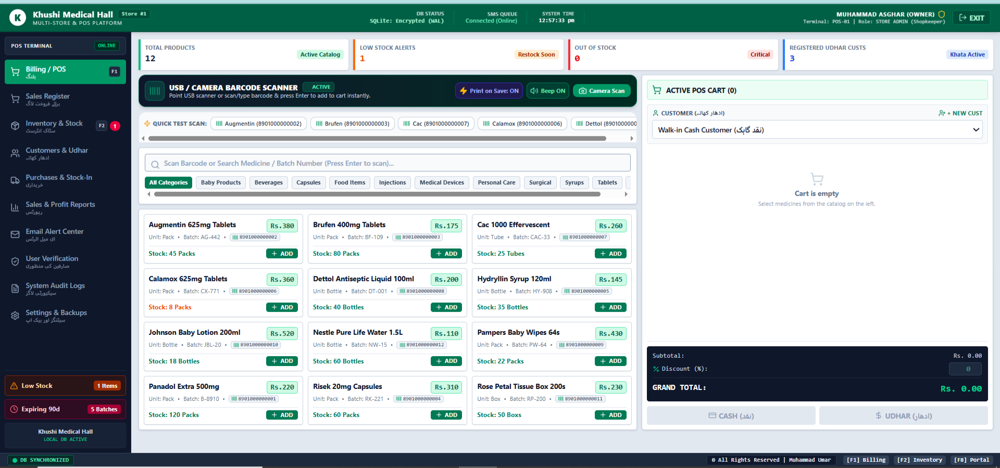
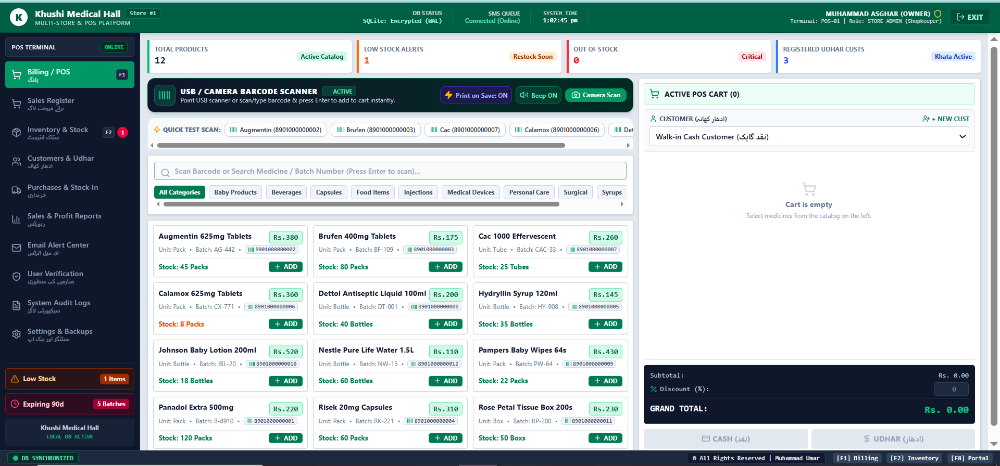
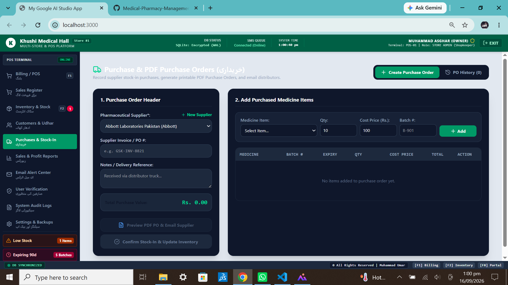
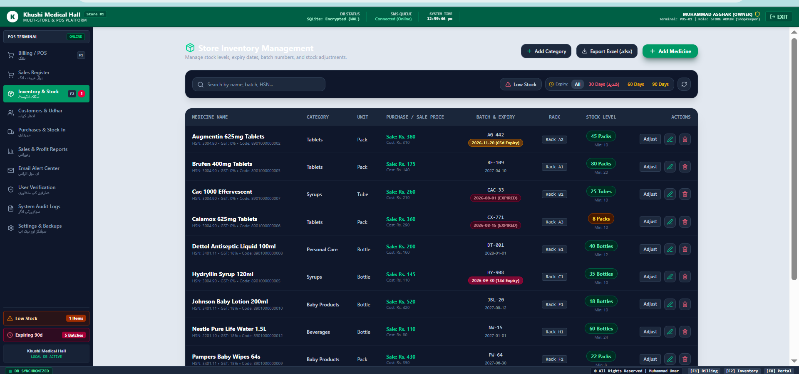
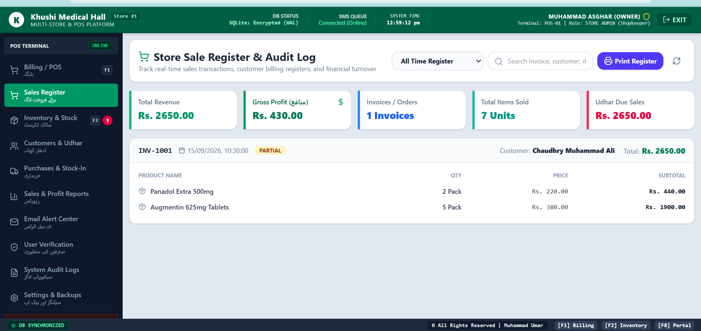
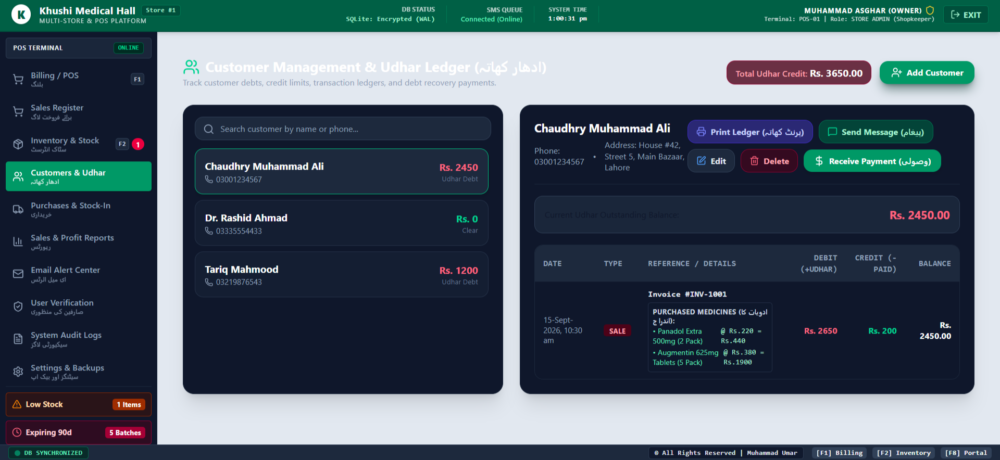
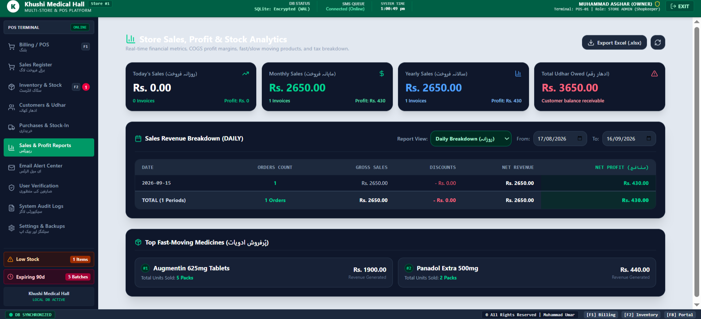

## 🏥 Khushi Medical Hall - Multi-Store & POS Platform

A complete **Electron + Next.js + TypeScript Pharmacy Management System** built for Khushi Medical Hall to manage billing, inventory, customers, udhar, purchases, and reports in one place.

## 📱 About
**Khushi Medical Hall POS** was built to digitize a real medical store workflow.
The goal is to make billing fast, stock tracking accurate, and udhar management simple for daily use. The app works 100% offline with encrypted SQLite database and supports USB & Camera barcode scanners.

This project focuses on real-world pharmacy needs, fast POS billing, and secure data handling.

## ✨ Key Features
- **🧾 Fast POS / Billing**: Scan barcode or search medicine/batch number and press Enter to add to cart instantly
- **📦 Inventory & Stock**: Track total products, low stock alerts, out of stock, batches, expiry
- **👥 Customers & Udhar**: Manage registered customers, walk-in customers, udhar/khata system
- **📥 Purchases & Stock-In**: Add new stock with batch number, expiry, supplier
- **📊 Sales & Profit Reports**: Daily/monthly sales, profit, and performance reports
- **🔔 Smart Alerts**: Low Stock (1 Items), Expiring in 90 Days (5 Batches), Email Alert Center
- **📷 USB / Camera Barcode Scanner**: Print on Save ON, Beep ON, Camera Scan support + Quick Test Scan
- **🔒 Secure & Offline First**: SQLite Encrypted (WAL), System Audit Logs, User Verification, Settings & Backups
- **🏪 Multi-Store Ready**: Store #1 support, Synchronized status, SMS Queue (Online/Offline)
- **⚡ Fast Performance**: Optimized for low-end pharmacy PCs

## 💻 Tech Stack
| Category | Technology |
| --- | --- |
| **Framework** | Next.js 14 + Electron |
| **Language** | TypeScript 99.1% |
| **Database** | SQLite (Encrypted WAL) |
| **Styling** | Tailwind CSS |
| **Scanner** | USB HID + Camera API |
| **IDE** | VS Code |

## 🏗️ Project Structure
```
├── app/                 # Next.js App Router (POS Terminal, Sales, Inventory)
├── components/          # Reusable UI components (Cart, Product Card, Scanner)
├── lib/                 # DB connection, SQLite helpers, SMS queue
├── electron/            # Electron main & preload.js
├── server.ts            # POS Server running on port 3000
├── public/              # Icons, assets
├── screenshots/         # App screenshots for README
└── patch_backup.cjs     # Backup script
```

## 🚀 Getting Started
To run this project locally:

1. **Clone the repo**
```bash
git clone https://github.com/urva734/Medical-Pharmacy-Management-System.git
cd Medical-Pharmacy-Management-System
```
## Install dependencies
```
npm install
```
## Run the POS Server
```
npm run dev
```
## Open http://localhost:3000
Note: Do not close the terminal. Server must be running for POS to work.

## 📸 Screenshots
| POS Terminal | Purchases & Stock-In | Inventory & Stock |
| :---: | :---: | :---: |
|  |  |  |

| Sales Register | Customers & Udhar | Sales & Reports |
| :---: | :---: | :---: |
|  |  |  |

   ## 📸 Screenshots
| POS Terminal | Billing | Inventory |
| :---: | :---: | :---: |
|  |  |  |

| Sales Register | Customers & Udhar | Reports |
| :---: | :---: | :---: |
|  |  |  |

## 🔮 Future Improvements
- [ ] Add cloud backup & sync for multi-store
- [ ] SMS integration for customer alerts
- [ ] Profit & loss advanced analytics
- [ ] Thermal printer integration
- [ ] Role-based login (Owner, Staff, Cashier)
- [ ] Dark mode support

## 👤 Author 
**Urva Sohail** - Aspiring Full Stack Developer  
GitHub: [@urva734](https://github.com/urva734)

